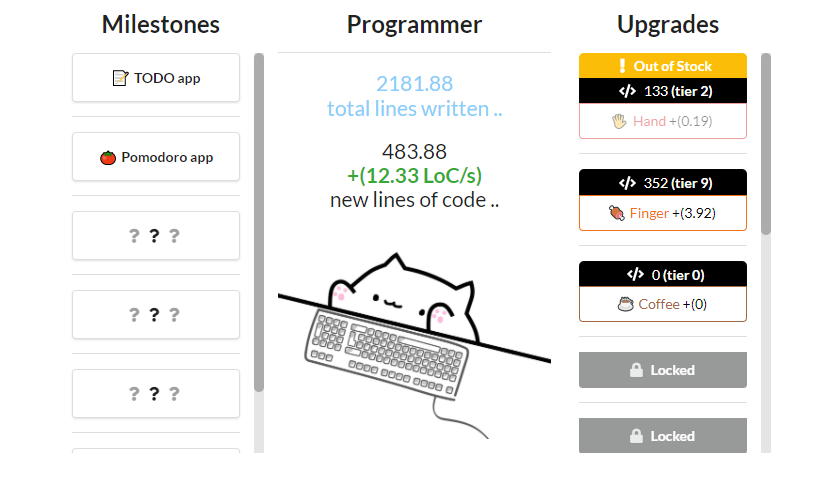

  

<h3 align="center">Idle game prototype</h3>

## 🧐 About 

This is a simple idle game prototype I made in around five days while learning how to use ReactJS. The prototype is about a programmer bango cat banging on the keyboard to write code and the player helping it get better at it as time goes. I made it during the [Coding Blocks game jam](https://itch.io/jam/coding-blocks-2021/) but didn't submit it since it wasn't part of the theme.